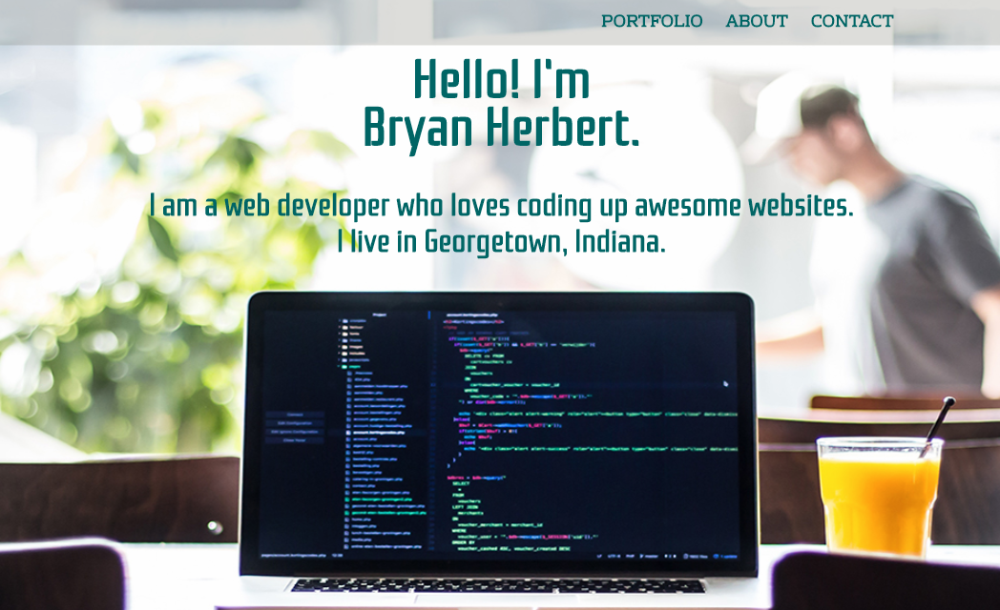

# Portfolio Website - *my personal website*
**A personal Portfolio website, all about me and my coding projects**

## General info

This is my own personal Portfolio website. My website currently features two different pages. It comes with a *Home* page, as well as a *Work* page for additional portfolio projects.  There is a navigation menu at the top of the *Home* page to link to various sections: the *Portfolio*, *About*, and *Contact* sections.  Also, the *"MORE-->"* link on this page takes the user to my *Work* page. There are external links located in the *Contact* section, which allows the user to access my social media and *Github* pages.  There is also a link to my email address, as well as other contact information.

My website has been developed to be responsive to various devices, with a **mobile-first design**.  The navigation menu also collapses to be mobile-friendly, with a "hamburger" icon to access and reopen it.

The purpose of this project was to build a personal website to showcase all my coding projects as a web developer, and to tell more about myself!  I have created and coded this website from its beginning.  I have strived to keep my code neat, organized, and easy to read.  This site has given me plenty of opportunity to practice with a variety of HTML5 and CSS syntax, as well as some JavaScript.  I have focused on keeping it simple and easy to use.  I've learned skills in page layouts as well.  For responsiveness, I even went back and restructured the entire site as mobile-first.

This website will continue to be adjusted and enhanced regularly, and has been a great learning experience.  While it contains many projects, the website in itself has proven to be great project, with many coding skills being used along the way.  I regularly have the opportunity to get the content uploaded and live on the internet, and to track this and the other projects on *Git and Github*.  I also enjoy seeing my progress, as I pick up many new coding skills in my journey. It's exciting to learn more every day! 

## Technologies

- HTML5
- CSS
- JavaScript
- Responsive Development

## Screenshot




## Code Examples

```
<!--CONTACT section-->
          <section id="contact">
           <div class="full-width">
             <h2>Let's Connect</h2>
             <div class="third-width">
               <h3>Hire Me</h3>
               <p>812-399-2394</p>
               <a href="mailto:bryan77@twc.com">bryan77@twc.com</a>
             </div>
             <div class="third-width">
               <h3>Follow Me</h3>
               <ul>
                 <li><a href="https://twitter.com/BryanHerbert2" target="_blank"></a></li>
                 <li><a href="https://github.com/codeherbert" target="_blank"></a></li>
                 <li><a href="https://www.linkedin.com/in/bryan-herbert-437560165" target="_blank"></a></li>
                 <li><a href="https://www.facebook.com/bryan.herbert.102" target="_blank"></a></li>
               </ul>
             </div>
  
```

```
#work h3 {
  font-family: 'Orbitron', sans-serif;
  font-weight: bold;
  text-align: center;
  text-transform: uppercase;
}

#work h4 {
  padding: 5%;
  text-align: center;
}

#work p {
  margin: 0 auto;
  padding: 5%;
  text-align: center;
}
```
  
## Setup

This project is my [personal portfolio website](http://www.bryanwesleyherbert.com)

## Status

Project is: *in progress*

## Sources

Various linked project tutorials were provided by **Skillcrush** - *online course*

Other linked project tutorials provided by **The Web Developer Bootcamp** - *online course*

## Contact

Created by **Bryan Herbert** [bryanwesleyherbert.com](http://www.bryanwesleyherbert.com) / email: bryan77@twc.com - Feel free to contact me!


  
  


